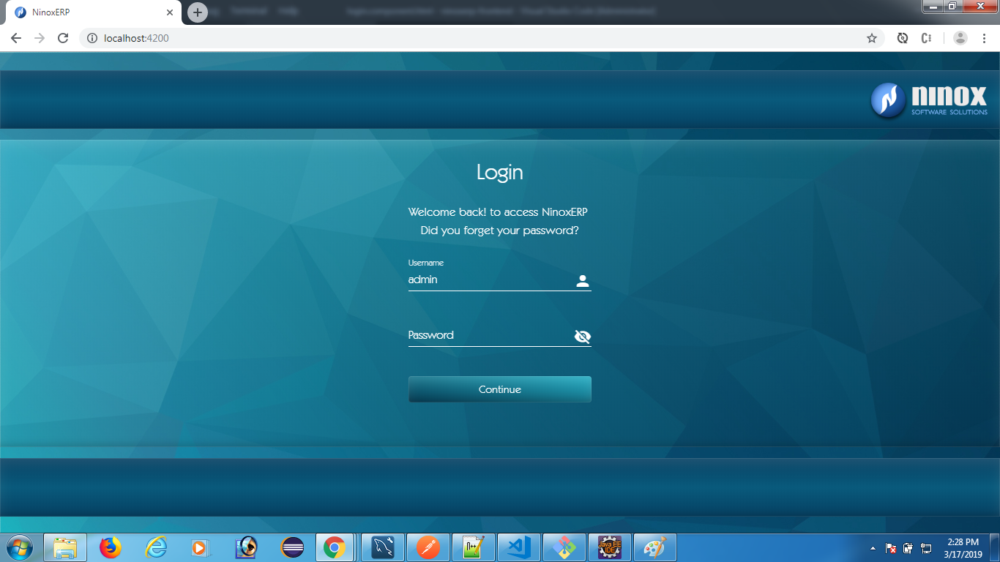

# Angular7-Reactive-forms-Filters
Angular7 - Reactive forms and custom filters in column level.

This Ninox ERP application I have created as two different project 
  * Front end is developed using Angular 7.0.1
  * Back end is developed using Spring Boot Rest API, MySql with OAuth2 Security.

Note:- I haven't posted my integarated(Fron & Back end) source.
  For a learning purpose I have posted this source in github.
  Back end source is given in my github - https://github.com/subahanih/Spring-Boot-OAuth2-Configuration-MySql

### Login Screen

### Main Screen

## Development server

Run `ng serve` for a dev server. Navigate to `http://localhost:4200/`. The app will automatically reload if you change any of the source files.

## Code scaffolding

Run `ng generate component component-name` to generate a new component. You can also use `ng generate directive|pipe|service|class|guard|interface|enum|module`.

## Build

Run `ng build` to build the project. The build artifacts will be stored in the `dist/` directory. Use the `--prod` flag for a production build.

## Running unit tests

Run `ng test` to execute the unit tests via [Karma](https://karma-runner.github.io).

## Running end-to-end tests

Run `ng e2e` to execute the end-to-end tests via [Protractor](http://www.protractortest.org/).

## Further help

To get more help on the Angular CLI use `ng help` or go check out the [Angular CLI README](https://github.com/angular/angular-cli/blob/master/README.md).

